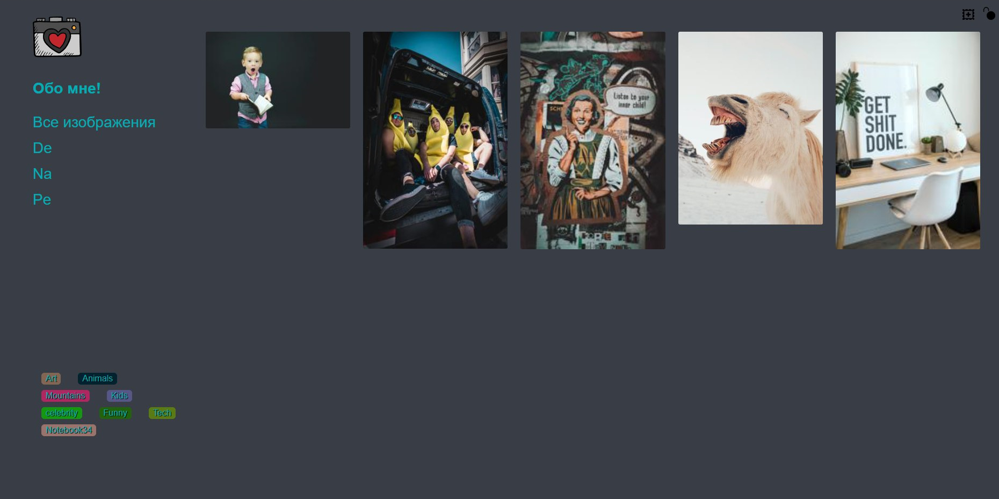
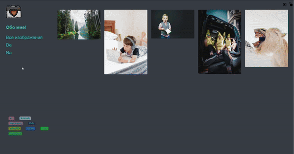

# Gallery
> Сайт-портфолио, галерея, разделённая на разделы, с системой тегов и простой авторизацией

||
|-|
||

## Frontend
### Стек
- Angular 14
- RxJS
- SCSS

### Запуск
    npm install
    npm run start

## Backend
### Стек
- Python
- FastAPI
- pydantic
- databases
- dotenv
- Pillow
- aiofiles

### Запуск
    pip install -r requirements.txt

Для новых версий FastAPI

    fastapi dev ./main.py

Для более старых версий FastAPI

    python -m uvicorn main:app --reload --host=127.0.0.1 --port=5000 --log-level=debug

Или воспользоваться `run.sh`/`run.bat` 